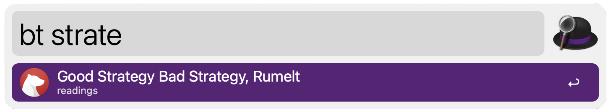
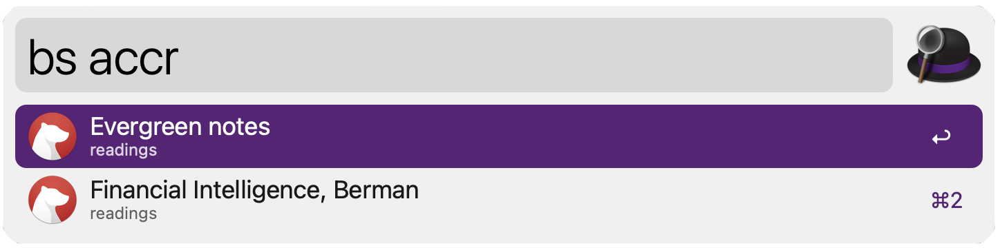
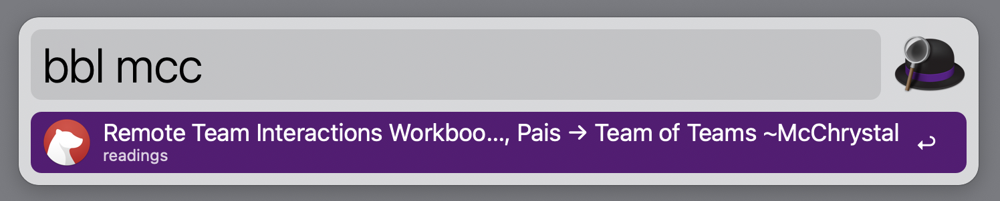
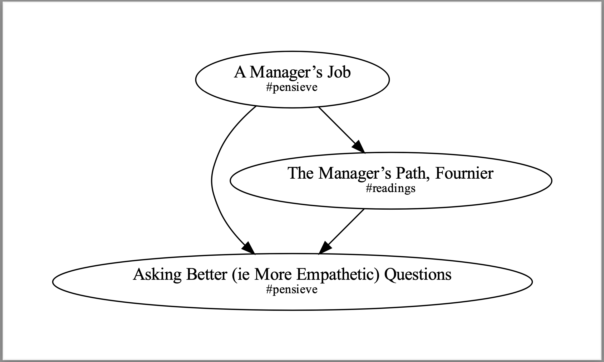

# freddiebear

An [Alfred](https://www.alfredapp.com/) + [Bear](https://bear.app) workflow.

Inspired by [alfred-bear](https://github.com/chrisbro/alfred-bear), implemented in [Go](https://go.dev/) for faster searching, with daily note journaling capabilities.

# List of Alfred Workflow Triggers

Keyword | Field | Action
-- | -- | --
`bt` | Title | Open note by title (Alfred filters results)
`btitle` | Title | Open (or create) a note by title (Forks a new process on every keystroke to run SQL)
`bs` | Body | Open a note by full-text search
`btag` | Tags | Open Bear to the selected tag
`bsearch` | Open Bear given your specified search
`bbl` | Multi-Note | Open a note by searching its backlinks (by title)
`bfl` | Multi-Note | Open a note by searching its forward links (by title)
`captainslog` | Single Note | Open (or create) a daily note
`btranscript` | Single Note | Collect related sections across daily notes to populate a new note (WIP)
`bg` | Multi-Note | Show graph of all notes
`bhist` | Single Note | Open GitHub/Lab history for specificed note

# Searching

To search for a note by title, use the `bt` keyword.



To search a note by its full contents, use the `bs` keyword.



To search for a note's backlinks, use the `bbl` keyword.



Here you can see that searching for `mcc` shows `Remote Team Interactions Workbook ~Skelton, Pais` which
references `Team of Teams ~McChrystal`.

Selecting that item will open `Remote Team Interactions Workbook ~Skelton, Pais`.

The `btag` and `bsearch` keywords will pass your search into Bear's search bar, thereby doing in-app filtering. All other search commands will open a single note.

# Creating

If your `btitle` search fails to find any matching notes, the workflow will give you an option to create a new note w/ a title of the same name.


# Journaling
The `captainslog` keyword will either open today's log (a note with the title `YYYY-MM-DD`) or create a new note with that title.

Run `freddiebear help journal` for details on how to tweak the tag it attaches to new notes.


# Exporting

You can `export` the text contents of your notes to Markdown files. Specify the directory and we'll create files in the form of `<title> (<sha>).md`.

Titles aren't unique, so we append a unique ID for each note. This also allows us to track renamed notes.

This can be used in conjunction with the sample script `backup.sh` -- it exports your notes and attachments and pushes them to GitHub for archiving and a rudimentary form of revision history.

# Graph

You can create a [Graphviz](https://graphviz.org/) `graph` of how notes are linked together. The Alfred keyword `bg` will redirect `freddiebear graph` to a `.dot` file, generate a PDF from it, and open the PDF w/ Preview.

Requires `graphviz`.




# Implementation

This Golang implementation is pretty snappy on my current 5MB database. Most of the performance gains of this implementaion over a Python implementation appear to be reduced startup cost. That said, [db.go](https://github.com/mnadel/freddiebear/blob/main/db/db.go) includes some SQLite3 pragmas that will hopefully keep it snappy as it grows. Sample timing that returns about half the records in the database:

```
# time freddiebear search --all drip >/dev/null
freddiebear search --all drip > /dev/null  0.00s user 0.00s system 24% cpu 0.029 total
```

## --show-tags

Show tags will generate a list longest-path tags to show as an Alfred item's subtitle.

For example, a note with a tags `q` and `a/b/c` will have four tags in the database:
1. `q`
1. `a`
1. `a/b`
1. `a/b/c`

And we'll only return the terminal/non-intermediate tags (`a/b/c` and `q` in this example).

The current implementation uses a naive O(n^2) algorithm, but in practice is quite fast for small sets of tags:

```
→ go test -bench=.
goos: darwin
goarch: amd64
pkg: github.com/mnadel/freddiebear/util
cpu: Intel(R) Core(TM) i9-9880H CPU @ 2.30GHz
BenchmarkRemoveIntermediatePrefixes-16   4701206               233.7 ns/op
```

And if you've got an M1, it's 36% faster:
```
→ go test -bench=.
goos: darwin
goarch: arm64
pkg: github.com/mnadel/freddiebear/util
BenchmarkRemoveIntermediatePrefixes-10           7679737               149.4 ns/op
```
